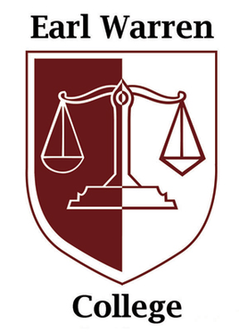

# Alan Tram, 3rd Year Cog Sci Major and CSE Minor

  

## About Me

* Warren College  
* Research Student for [TRELS](https://ugresearch.ucsd.edu/research-programs/trels/index.html) Program 
* Avid Sports Fan
	* **Milwaukee Bucks**  
	* **Liverpool FC** 
* Love to cook and play games like **League of Legends** and **NBA 2k** 
	* [Here's my favorite recipe](https://whiteonricecouple.com/recipes/roasted-salmon-recipe-miso-glaze/) 

## About My Coding
* Favorite languages are **Python, HTML, CSS, and Javascript** 
* I've used APIs such as **Pandas, JQuery, AJAX, and PIL**
* Tend to wireframe and storyboard first, then transform that into working code
* I'm looking into learning **React and Swift** for Mobile Development 